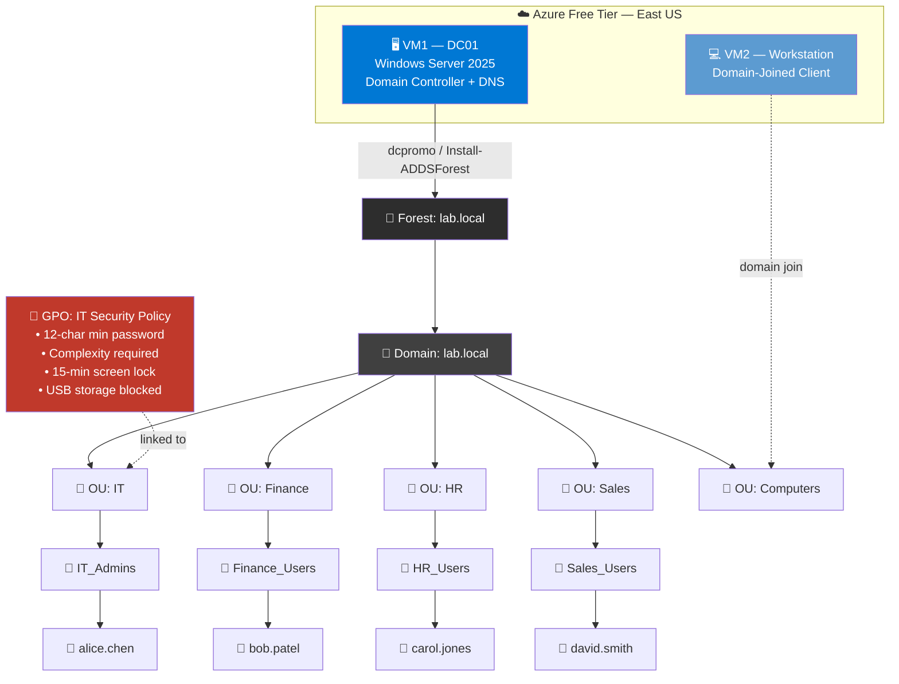
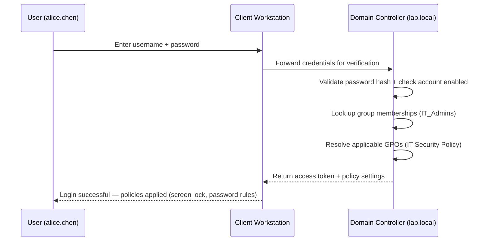

# Lab 01 — Active Directory Domain Services

**Identity & Access Management on Windows Server 2025**

[](#) [](#) [](#) [](#)

| | |
|---|---|
| **Certification alignment** | CompTIA Network+ · Security+ · Azure Administrator |
| **Tools used** | Windows Server 2025 Evaluation (180-day) · Azure Free Account |
| **Time to complete** | 3–5 hours across multiple sessions |
| **Cost** | $0 — fully covered by free tiers and evaluation licenses |
| **Career relevance** | IT Support · Sysadmin · Cloud Engineer · Security Analyst |

---

## 📋 Overview

Active Directory is the identity backbone of most enterprise Windows environments. It answers one core question: **who is allowed to do what?** It controls which users can log into which machines, which groups can access which resources, and which policies apply to which parts of the organization.

In this lab, I built a single-forest Active Directory environment from scratch — provisioning a Windows Server 2025 VM, promoting it to a Domain Controller, designing an OU structure, implementing role-based access control with security groups, enforcing settings domain-wide with Group Policy, and performing the day-one tasks every IT support and sysadmin role requires (password resets, account unlocks, offboarding, auditing).

This same identity model — users, groups, role-based access, centrally enforced policy — carries directly into cloud identity platforms like Microsoft Entra ID, which is why this lab is foundational even for cloud-focused roles.

---

## 🏗️ Architecture

The lab consists of two VMs inside a single Azure resource group: a Domain Controller running AD DS/DNS, and a client machine joined to the domain. The Domain Controller is the authoritative source for authentication, OU/group structure, and policy enforcement.



### Authentication flow



> Diagrams render natively in GitHub — no image files required. Edit the Mermaid blocks above directly if the lab topology changes.

---

## 🎯 Skills Demonstrated

| Skill | Real-world application |
|---|---|
| Promote a Windows Server to Domain Controller | First step in every enterprise Windows environment |
| Design Organizational Units (OUs) | Apply different policies to different departments at scale |
| Create users, groups, and group memberships | Role-based access control — the standard for enterprise permissions |
| Configure Group Policy Objects (GPOs) | Centrally enforce password policy, lockout, and device restrictions |
| Join a machine to the domain | Bring a workstation under centralized, policy-enforced management |
| Reset passwords / unlock accounts | The highest-volume help desk tickets in any organization |
| Offboard accounts (disable, not delete) | Preserve audit history while immediately revoking access |
| Audit accounts and group membership via PowerShell | Compliance and security reporting |

---

## 🛠️ Environment

- **Compute:** Azure `Standard_B2s` VM (2 vCPU / 4GB RAM), Windows Server 2025 Datacenter — Gen2
  *(Alternative: VirtualBox locally — 4GB RAM / 60GB disk minimum per VM)*
- **Region:** East US
- **Domain:** `lab.local` (single forest, single domain)
- **Roles installed:** AD DS, DNS, GPMC
- **Access method:** RDP (native Remote Desktop client, not browser console — for clipboard support)

---

## 📁 Repository Structure

```
lab-01-active-directory/
├── README.md                  ← you are here
├── docs/
│   ├── lab-guide.md            # Full step-by-step walkthrough
│   └── screenshots/
│       ├── 01-vm-provisioning.png
│       ├── 02-adds-role-install.png
│       ├── 03-domain-promotion.png
│       ├── 04-ou-structure.png
│       ├── 05-gpo-config.png
│       └── 06-verification.png
└── scripts/
    ├── 01-promote-domain-controller.ps1
    ├── 02-create-ou-structure.ps1
    ├── 03-create-groups.ps1
    ├── 04-create-users.ps1
    └── 05-helpdesk-tasks.ps1
```

> 🔧 **Adjust this tree to match your actual repo.** Add real screenshots to `docs/screenshots/` and update the paths above — recruiters and reviewers respond far better to a README with visual proof of work than text alone.

---

## 🚀 Build Steps

<details>
<summary><strong>Step 1 — Provision the VM</strong></summary>

Created an Azure VM using Windows Server 2025 Datacenter (Gen2), `Standard_B2s` size, RDP (3389) inbound allowed. VM stopped between sessions to stay within free-tier compute hours.

</details>

<details>
<summary><strong>Step 2 — Install Active Directory Domain Services</strong></summary>

```powershell
Install-WindowsFeature -Name AD-Domain-Services -IncludeManagementTools
Install-WindowsFeature -Name GPMC
```

</details>

<details>
<summary><strong>Step 3 — Promote to Domain Controller</strong></summary>

```powershell
Import-Module ADDSDeployment
Install-ADDSForest `
  -DomainName 'lab.local' `
  -DomainNetBiosName 'LAB' `
  -InstallDns:$true `
  -SafeModeAdministratorPassword (ConvertTo-SecureString 'YourDSRMPassword!' -AsPlainText -Force) `
  -Force:$true
```

This created a new forest and domain (`lab.local`), with this server as the authoritative DNS and identity source.

</details>

<details>
<summary><strong>Step 4 — Build OUs, Groups, and Users</strong></summary>

```powershell
# Organizational Units
New-ADOrganizationalUnit -Name "IT"        -Path "DC=lab,DC=local"
New-ADOrganizationalUnit -Name "Finance"   -Path "DC=lab,DC=local"
New-ADOrganizationalUnit -Name "HR"        -Path "DC=lab,DC=local"
New-ADOrganizationalUnit -Name "Sales"     -Path "DC=lab,DC=local"
New-ADOrganizationalUnit -Name "Computers" -Path "DC=lab,DC=local"

# Security Groups
New-ADGroup -Name "IT_Admins"     -GroupScope Global -GroupCategory Security -Path "OU=IT,DC=lab,DC=local"
New-ADGroup -Name "Finance_Users" -GroupScope Global -GroupCategory Security -Path "OU=Finance,DC=lab,DC=local"
New-ADGroup -Name "HR_Users"      -GroupScope Global -GroupCategory Security -Path "OU=HR,DC=lab,DC=local"
New-ADGroup -Name "Sales_Users"   -GroupScope Global -GroupCategory Security -Path "OU=Sales,DC=lab,DC=local"

# Users + group assignment
$password = ConvertTo-SecureString "Welcome@2026!" -AsPlainText -Force

New-ADUser -Name "alice.chen" -GivenName "Alice" -Surname "Chen" `
  -SamAccountName "alice.chen" -UserPrincipalName "alice.chen@lab.local" `
  -Path "OU=IT,DC=lab,DC=local" -AccountPassword $password -Enabled $true

Add-ADGroupMember -Identity "IT_Admins" -Members "alice.chen"
# ...repeated for bob.patel (Finance), carol.jones (HR), david.smith (Sales)
```

</details>

<details>
<summary><strong>Step 5 — Configure Group Policy</strong></summary>

Created **IT Security Policy** GPO, linked to the `IT` OU:

| Setting | Value | Purpose |
|---|---|---|
| Minimum password length | 12 | Enforce strong passwords |
| Password complexity | Enabled | Require upper/lower/number/symbol |
| Machine inactivity limit | 900 sec | Auto-lock after 15 minutes |
| Removable storage access | Deny all | Prevent data exfiltration via USB |

Validated by joining a second VM to `lab.local`, moving its computer object into the `IT` OU, running `gpupdate /force`, and confirming policy applied for `alice.chen`.

</details>

<details>
<summary><strong>Step 6 — Help Desk Operations</strong></summary>

```powershell
# Reset password + force change at next login
Set-ADAccountPassword -Identity "bob.patel" -Reset -NewPassword (ConvertTo-SecureString "NewPass@2026!" -AsPlainText -Force)
Set-ADUser -Identity "bob.patel" -ChangePasswordAtLogon $true

# Unlock a locked account
Unlock-ADAccount -Identity "carol.jones"

# Offboard a user (disable, not delete — preserves audit trail)
Disable-ADAccount -Identity "david.smith"

# Audit: accounts inactive 90+ days
$cutoff = (Get-Date).AddDays(-90)
Get-ADUser -Filter {LastLogonDate -lt $cutoff -and Enabled -eq $true} -Properties LastLogonDate |
  Select-Object Name, LastLogonDate
```

</details>

---

## ✅ Verification

| Check | Command | Expected Result |
|---|---|---|
| Domain controller is running | `Get-ADDomainController` | Returns DC info for forest `lab.local` |
| OUs exist | `Get-ADOrganizationalUnit -Filter *` | Lists all 5 OUs |
| Users exist and enabled | `Get-ADUser -Filter {Enabled -eq $true}` | Lists 4 test accounts |
| Group membership correct | `Get-ADGroupMember -Identity IT_Admins` | Returns `alice.chen` |
| GPO is linked | `Get-GPInheritance -Target 'OU=IT,DC=lab,DC=local'` | Shows `IT Security Policy` |

---

## 🧰 Troubleshooting

| Problem | Fix |
|---|---|
| PowerShell prompts for `Name:` when creating users | `$password` wasn't defined first — run the full script block together, not line by line |
| Can't copy/paste into the VM | RDP client → **Show Options** → **Local Resources** → check **Clipboard**; or download the RDP file from the Azure portal instead of using the browser console |
| Promotion fails with DNS conflict | Set the NIC's preferred DNS to `127.0.0.1` before promoting |
| Can't RDP after domain join | Log in as `LAB\Administrator`, not local `Administrator` |
| GPO not applying | Run `gpupdate /force`, then `gpresult /r` to confirm applied policies |
| User can't log in after creation | Confirm `Enabled = $true` and check `ChangePasswordAtLogon` setting |
| ADUC not showing in Tools menu | Run `dsa.msc`, or `Add-WindowsFeature RSAT-ADDS` |

---

## 📚 Key Takeaways

> *Add your own reflection here — what surprised you, what you'd do differently at enterprise scale, and how this maps to a role you're targeting. This section is what turns a lab into a portfolio piece an interviewer actually remembers.*

---

## 📬 Contact

**[Your Name]** — [LinkedIn](#) · [Portfolio](#) · [Email](#)
